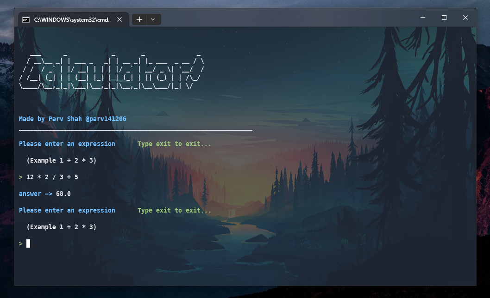
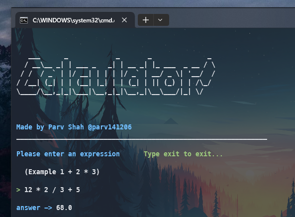

            ___            ___ ___         ___
             | |            | | | |         | |
             | |__     ___  | | | |   ___   | |
             | '_ \   / _ \ | | | |  / _ \  | |
             | | | | |  __/ | | | | | (_) | |_|
             |_| |_|  \___| |_| |_|  \___/  (_)

# This is a simple calculator which uses Stack and polish notations for calculating!

# Ignore all spelling mistakes ✌

## Example


<br>
<br>


## Requirements:

- Java!

# How to run:

You can just run the RUN batch file!

- If you want to run it manually, just run:

```
javac Main.java
java Main
```

# Made with ❤ by @parv141206
